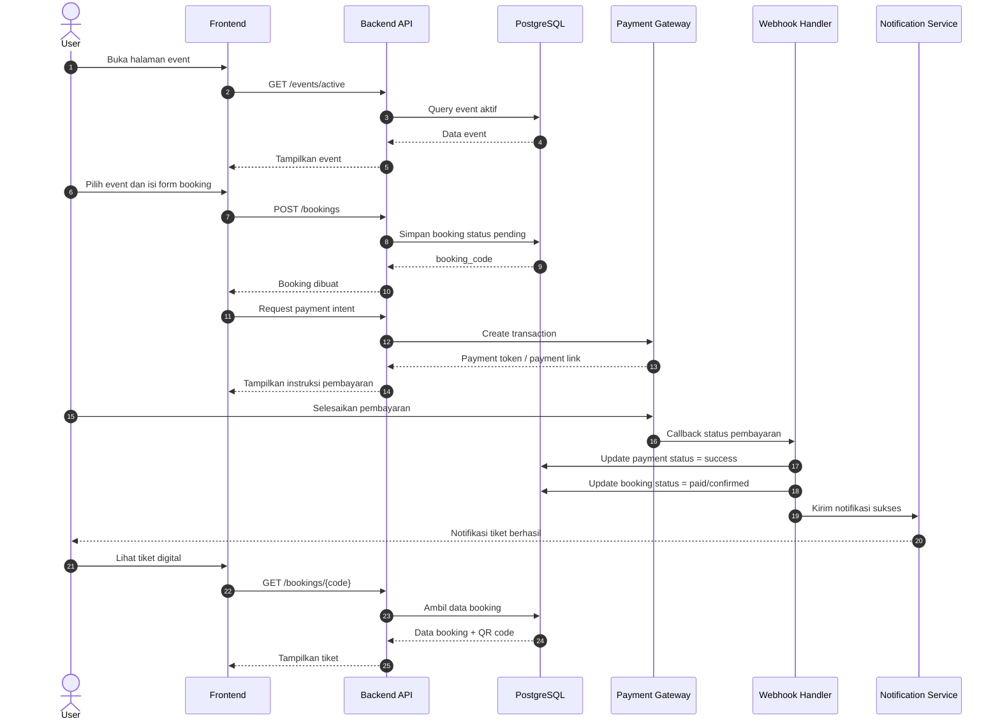
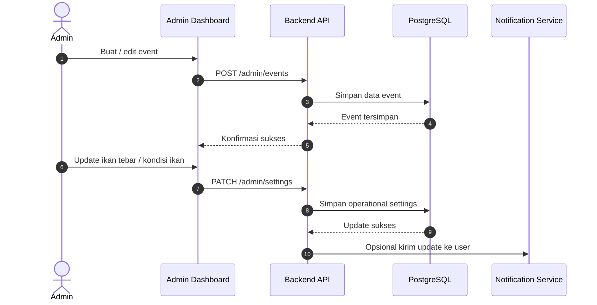

# PRD: Pemancingan Adem Ayem Dlopo

## 1. Project Overview

### 1.1 Ringkasan Produk
Aplikasi ini adalah platform digital resmi untuk satu lokasi, **Pemancingan Adem Ayem Dlopo**, yang berfungsi sebagai:
- Sistem pemesanan tiket untuk event memancing
- Pusat informasi operasional pemancingan
- Media promosi event, berita, galeri, dan hasil tangkapan
- Kanal pembayaran tiket dengan berbagai metode
- Dashboard admin untuk mengelola event, konten, tiket, pembayaran, dan data lapangan

### 1.2 Tujuan Utama
- Memudahkan pelanggan melihat jadwal event dan membeli tiket secara online
- Menyediakan informasi lengkap tentang pemancingan dalam satu tempat
- Mempermudah admin mengelola event, kapasitas, data ikan tebar, transaksi, dan konten publik
- Meningkatkan pengalaman pengguna melalui informasi real-time dan notifikasi

### 1.3 Target Pengguna
- Pemancing umum yang ingin mengikuti event
- Komunitas pemancing lokal dan luar kota
- Pengunjung yang mencari informasi lokasi, jadwal, dan cuaca
- Admin/pengelola pemancingan
- Operator lapangan yang memantau event dan validasi tiket

### 1.4 Platform
- MVP aplikasi desktop/mobile berbasis Kivy untuk validasi alur pengguna
- Website responsif dan panel admin web pada tahap produksi
- Aplikasi mobile Android/iOS pada tahap lanjutan setelah MVP tervalidasi

### 1.5 Batasan Domain Utama
- Aplikasi hanya melayani satu lokasi pemancingan
- Seluruh kolam dan event khusus ikan nila
- Seluruh data tebar, hasil tangkapan, leaderboard, galeri, dan kondisi ikan harus merujuk pada ikan nila
- Sistem tidak boleh menampilkan ikan mas, bawal, lele, atau spesies lain sebagai komoditas kolam
- Umpan wajib berasal dari bahan alami
- Media, bahan, atau umpan yang tidak berasal dari alam dilarang
- Essen dan pemanis diperbolehkan hanya sebagai campuran umpan alami dan tidak boleh digunakan sebagai umpan utama

### 1.6 Data Harga dan Kapasitas Aktual
- Grand Mix Babaon: pelepasan ikan nila 225 kg, harga tiket Rp100.000
- Paket event nila 200 kg: harga tiket Rp85.000
- Paket event nila 150 kg: harga tiket Rp70.000
- Paket event nila 100 kg: harga tiket Rp50.000
- Kolam memiliki total 82 lapak bernomor 01 sampai 82
- Satu tiket pada MVP mewakili satu lapak
- Jumlah lapak terisi harus berasal dari data booking, bukan angka perkiraan

## 2. Core Features

### 2.1 Fitur Publik

#### A. Beranda
Menampilkan ringkasan utama pemancingan:
- Event aktif dan event mendatang
- Harga tiket event terdekat
- Informasi jam buka dan tutup
- Jumlah ikan tebar hari ini
- Cuaca dan kondisi ikan
- Highlight hasil tangkapan terbaik
- Berita terbaru
- Galeri foto/video terbaru
- CTA cepat untuk pesan tiket

#### B. Jadwal Event Memancing
- Daftar event yang akan datang
- Seluruh event merupakan event memancing ikan nila
- Detail event:
  - Nama event
  - Tanggal dan jam
  - Lokasi
  - Harga tiket
  - Kapasitas peserta
  - Sisa kuota
  - Jenis event
  - Hadiah atau kategori lomba
  - Aturan event
- Filter berdasarkan tanggal, status, atau jenis event
- Event detail page dengan tombol pesan tiket

#### C. Booking Tiket Event
- Pengguna memilih event
- Mengisi data peserta:
  - Nama
  - Nomor HP
  - Jumlah tiket
  - Catatan tambahan
- Sistem menghitung total biaya
- User memilih metode pembayaran
- User wajib membaca dan menyetujui aturan umpan sebelum booking dibuat
- Status booking:
  - Pending
  - Menunggu pembayaran
  - Terbayar
  - Dikonfirmasi
  - Dibatalkan
  - Kadaluarsa
- Tiket digital dengan kode unik / QR code

#### D. Pembayaran Multi Metode
- Transfer bank
- E-wallet
- Virtual account
- QRIS
- Manual upload bukti transfer bila diperlukan
- Status pembayaran otomatis atau manual tergantung gateway
- Riwayat pembayaran per booking

#### E. Informasi Operasional Pemancingan
- Jadwal buka dan tutup
- Informasi lokasi
- Aturan pemancingan
- Harga event
- Informasi jumlah ikan tebar harian
- Informasi kondisi ikan:
  - Nafsu makan
  - Normal
  - Kurang aktif
- Informasi ini dikelola admin dan bisa ditampilkan sebagai status harian
- Peraturan umpan harus ditampilkan jelas:
  - Umpan utama wajib berbahan alami
  - Media atau bahan non-alami dilarang
  - Essen/pemanis hanya boleh menjadi campuran umpan alami

#### F. Hasil Tangkapan
- Leaderboard pemancing dengan tangkapan terbanyak
- Data yang bisa ditampilkan:
  - Nama peserta
  - Event
  - Berat total ikan
  - Jumlah ekor
  - Jenis ikan, bernilai tetap `nila` pada versi saat ini
  - Foto tangkapan
- Bisa difilter per event, per hari, atau periode tertentu

#### G. Galeri
- Foto dan video acara
- Momen seru
- Hasil tangkapan peserta
- Dokumentasi venue
- Album per event

#### H. Berita dan Update
- Pengumuman event mendatang
- Info perubahan jadwal
- Prediksi event yang akan datang
- Promo atau info khusus
- Artikel berita internal pemancingan

#### I. Lokasi dan Panduan Rute
- Peta lokasi
- Alamat lengkap
- Titik koordinat
- Tautan Google Maps resmi: `https://maps.app.goo.gl/cQtnrkjTiAvC5JNC7`
- Panduan menuju lokasi dari pusat kota Kediri
- Opsi buka di Google Maps / Waze
- Estimasi jarak dan waktu tempuh

#### J. Cuaca dan Kondisi Ikan
- Integrasi cuaca harian
- Tampilan:
  - Suhu
  - Hujan/tidak
  - Kecepatan angin
  - Kelembapan
- Status kondisi ikan yang diinput admin:
  - Aktif
  - Normal
  - Pasif
- Rekomendasi sederhana untuk peserta

### 2.2 Fitur Admin

#### A. Manajemen Event
- Buat, edit, hapus event
- Set tanggal, jam, harga, kuota, aturan, hadiah
- Publikasikan atau sembunyikan event
- Set status event:
  - Draft
  - Published
  - Closed
  - Finished

#### B. Manajemen Booking
- Lihat seluruh booking
- Filter berdasarkan status pembayaran, event, atau tanggal
- Validasi manual pembayaran
- Batalkan booking
- Cetak atau kirim ulang tiket

#### C. Manajemen Ikan Tebar
- Input jumlah ikan tebar harian
- Jenis ikan
- Estimasi berat
- Catatan tambahan
- Riwayat tebar ikan per tanggal/event

#### D. Manajemen Hasil Tangkapan
- Input hasil peserta
- Upload foto
- Tandai leaderboard
- Verifikasi data tangkapan

#### E. Manajemen Konten
- Kelola galeri
- Kelola berita
- Kelola banner
- Kelola halaman statis seperti aturan, FAQ, kontak

#### F. Manajemen Lokasi dan Info Operasional
- Update jam buka/tutup
- Update alamat dan peta
- Update status cuaca manual atau via API
- Update status mood ikan

#### G. Laporan dan Dashboard
- Total tiket terjual
- Pendapatan per event
- Event paling laris
- Booking pending dan sukses
- Ringkasan peserta
- Statistik hasil tangkapan

## 3. User Flow & Architecture

### 3.1 User Flow Publik

#### Flow 1: Melihat Informasi dan Booking Tiket
1. User membuka homepage
2. User melihat event terdekat dan informasi pemancingan
3. User memilih event
4. User membuka detail event
5. User klik "Pesan Tiket"
6. User mengisi data diri dan jumlah tiket
7. Sistem menghitung total harga
8. User memilih metode pembayaran
9. User menyelesaikan pembayaran
10. Sistem mengubah status booking
11. User menerima tiket digital / QR code
12. User datang ke lokasi dan menunjukkan tiket

#### Flow 2: Melihat Informasi Tanpa Booking
1. User membuka homepage
2. User melihat jadwal, cuaca, ikan tebar, galeri, dan berita
3. User membuka peta lokasi
4. User membaca panduan menuju lokasi
5. User kembali kapan pun untuk cek event terbaru

#### Flow 3: Cek Hasil Tangkapan
1. User membuka halaman leaderboard
2. User memilih event/periode
3. Sistem menampilkan hasil tangkapan terbanyak
4. User melihat foto, nama pemancing, dan detail tangkapan

### 3.2 Flow Admin
1. Admin login ke dashboard
2. Admin membuat atau mengubah event
3. Admin mengatur harga tiket dan kuota
4. Admin mempublikasikan event
5. User melakukan booking
6. Admin menerima notifikasi booking masuk
7. Admin memverifikasi pembayaran jika manual
8. Admin memperbarui status event saat hari pelaksanaan
9. Admin menginput ikan tebar, hasil tangkapan, dan konten dokumentasi
10. Admin menutup event setelah selesai
11. Admin melihat laporan performa event

### 3.3 Arsitektur Sistem

#### Komponen Utama
- Frontend publik
- Admin dashboard
- Backend API
- Database
- Payment gateway
- Notification service
- File storage untuk foto/video
- Weather API
- Maps API

#### Alur Data
- Frontend mengakses backend melalui API
- Backend mengelola autentikasi, booking, event, konten, dan pembayaran
- Database menyimpan seluruh data transaksional dan konten
- Payment gateway mengirim callback status pembayaran
- Storage menyimpan media galeri dan bukti pembayaran
- Weather API menyediakan data cuaca harian
- Maps API menyediakan lokasi dan rute

## 4. Database Schema

### 4.1 `users`
Menyimpan data pengguna.

- `id` UUID / bigint, primary key
- `name` varchar
- `phone` varchar
- `email` varchar, nullable
- `password_hash` varchar, nullable untuk akun login
- `role` enum: `customer`, `admin`, `operator`
- `created_at` timestamp
- `updated_at` timestamp

### 4.2 `events`
Menyimpan data event memancing.

- `id` UUID / bigint
- `title` varchar
- `slug` varchar unique
- `description` text
- `event_date` date
- `start_time` time
- `end_time` time
- `ticket_price` decimal
- `capacity` int
- `status` enum: `draft`, `published`, `closed`, `finished`
- `rules` text
- `prize_info` text
- `location_note` text
- `created_by` foreign key -> `users.id`
- `created_at`
- `updated_at`

### 4.3 `event_quota`
Opsional jika kuota ingin dipisah per kategori.

- `id`
- `event_id` foreign key
- `quota_total` int
- `quota_sold` int
- `quota_remaining` int
- `updated_at`

### 4.4 `bookings`
Data booking tiket.

- `id`
- `booking_code` varchar unique
- `user_id` foreign key -> `users.id`
- `event_id` foreign key -> `events.id`
- `participant_name` varchar
- `participant_phone` varchar
- `ticket_quantity` int
- `subtotal_amount` decimal
- `service_fee` decimal
- `total_amount` decimal
- `status` enum: `pending`, `awaiting_payment`, `paid`, `confirmed`, `cancelled`, `expired`
- `notes` text
- `expires_at` timestamp
- `created_at`
- `updated_at`

### 4.5 `payments`
Data pembayaran booking.

- `id`
- `booking_id` foreign key -> `bookings.id`
- `payment_method` enum: `bank_transfer`, `qris`, `ewallet`, `virtual_account`, `manual`
- `provider_reference` varchar nullable
- `amount` decimal
- `status` enum: `pending`, `success`, `failed`, `refunded`
- `paid_at` timestamp nullable
- `proof_url` varchar nullable
- `raw_response` json nullable
- `created_at`
- `updated_at`

### 4.6 `fish_stock_updates`
Data ikan tebar harian.

- `id`
- `event_id` foreign key nullable
- `stock_date` date
- `fish_type` varchar
- `quantity` int
- `estimated_weight` decimal nullable
- `note` text nullable
- `created_by` foreign key -> `users.id`
- `created_at`
- `updated_at`

### 4.7 `catch_records`
Data hasil tangkapan peserta.

- `id`
- `event_id` foreign key
- `booking_id` foreign key nullable
- `user_id` foreign key nullable
- `angler_name` varchar
- `fish_type` varchar
- `fish_count` int
- `total_weight` decimal
- `photo_url` varchar nullable
- `is_leaderboard` boolean default false
- `verified_by` foreign key -> `users.id` nullable
- `created_at`
- `updated_at`

### 4.8 `news_posts`
Berita dan update.

- `id`
- `title` varchar
- `slug` varchar unique
- `content` text
- `cover_image_url` varchar nullable
- `status` enum: `draft`, `published`, `archived`
- `published_at` timestamp nullable
- `created_by` foreign key -> `users.id`
- `created_at`
- `updated_at`

### 4.9 `gallery_items`
Galeri foto dan video.

- `id`
- `title` varchar
- `description` text nullable
- `media_type` enum: `image`, `video`
- `media_url` varchar
- `event_id` foreign key nullable
- `created_by` foreign key -> `users.id`
- `created_at`
- `updated_at`

### 4.10 `operational_settings`
Satu tabel untuk info operasional saat ini.

- `id`
- `open_time` time
- `close_time` time
- `today_fish_mood` enum: `active`, `normal`, `passive`
- `today_fish_mood_note` text nullable
- `today_weather_summary` varchar nullable
- `location_address` text
- `location_latitude` decimal nullable
- `location_longitude` decimal nullable
- `maps_url` varchar nullable
- `updated_by` foreign key -> `users.id`
- `updated_at`

### 4.11 `weather_snapshots`
Cache data cuaca.

- `id`
- `weather_date` date
- `temperature` decimal
- `humidity` decimal
- `rain_probability` decimal
- `wind_speed` decimal
- `condition_summary` varchar
- `source` varchar
- `raw_response` json nullable
- `created_at`
- `updated_at`

### 4.12 `notifications`
Riwayat notifikasi ke user.

- `id`
- `user_id` foreign key
- `type` varchar
- `title` varchar
- `message` text
- `channel` enum: `email`, `whatsapp`, `sms`, `push`, `in_app`
- `read_at` timestamp nullable
- `created_at`

### 4.13 `audit_logs`
Jejak perubahan admin.

- `id`
- `actor_user_id` foreign key
- `action` varchar
- `entity_type` varchar
- `entity_id` varchar
- `before_data` json nullable
- `after_data` json nullable
- `created_at`

### Relasi Kunci
- `users` 1:N `bookings`
- `events` 1:N `bookings`
- `bookings` 1:N `payments`
- `events` 1:N `fish_stock_updates`
- `events` 1:N `catch_records`
- `events` 1:N `gallery_items`
- `users` 1:N `news_posts`
- `users` 1:N `gallery_items`
- `users` 1:N `notifications`

## 5. Tech Stack Recommendation

Tujuannya adalah cepat dibangun, mudah dipelihara, dan sangat cocok untuk AI coding agent.

### 5.1 Rekomendasi Utama

#### Frontend
- Next.js
- TypeScript
- Tailwind CSS
- shadcn/ui
- TanStack Query
- Zod
- React Hook Form

Alasan:
- Struktur project jelas dan familiar untuk AI agent
- Support SSR/SSG untuk halaman publik
- Cepat untuk membangun dashboard dan landing page
- Komponen reusable dan mudah di-maintain

#### Backend
- Next.js API Routes atau NestJS jika ingin arsitektur lebih besar
- Untuk MVP, Next.js full-stack lebih efisien
- Prisma ORM untuk akses database
- Zod untuk validasi input

Alasan:
- Mengurangi kompleksitas awal
- Cocok untuk agent coding karena satu codebase
- Prisma membantu generate schema dan query yang aman

#### Database
- PostgreSQL

Alasan:
- Stabil, kuat untuk relasi dan transaksi
- Cocok untuk booking, payment, dan report
- Aman untuk skala lanjut

#### Auth
- NextAuth.js atau auth custom berbasis JWT/session
- Role-based access control untuk customer/admin/operator

#### Storage
- S3-compatible storage atau Cloudinary
- Untuk foto galeri, bukti transfer, dan foto hasil tangkapan

#### Payment Gateway
- Midtrans atau gateway lokal setara
- Support QRIS, VA, transfer bank, e-wallet

#### Maps
- Google Maps API atau Mapbox
- Untuk titik lokasi dan navigasi

#### Weather
- OpenWeatherMap atau provider cuaca lain
- Cache ke database agar hemat API call

#### Deployment
- Frontend/backend: Vercel atau platform Node hosting setara
- Database: Supabase / Neon / managed PostgreSQL
- Storage: Cloudinary / S3

### 5.2 Kenapa Stack Ini Optimal untuk AI Agent
- TypeScript membuat kontrak data lebih jelas
- Next.js meminimalkan jumlah project terpisah
- Prisma + PostgreSQL memudahkan agent membangun schema dan query
- Tailwind + shadcn/ui mempercepat UI generation
- Satu codebase memudahkan reasoning dan debugging

### 5.3 Jika Ingin Lebih Sederhana Lagi
Untuk MVP tercepat:
- Frontend + backend: Next.js
- Database: PostgreSQL
- ORM: Prisma
- Auth: NextAuth
- Payment: Midtrans
- Hosting: Vercel + managed PostgreSQL

## 6. Sequence Diagram

Berikut visualisasi alur sistem utama untuk booking tiket dan pembayaran.

### Diagram Tambahan: Admin Update Event

## 7. Non-Functional Requirements

### 7.1 Performance
- Homepage harus cepat dimuat
- Halaman event dan booking harus responsif
- Query leaderboard dan galeri harus dioptimalkan

### 7.2 Security
- Role-based access control
- Validasi input di frontend dan backend
- Proteksi webhook payment gateway
- Audit log untuk perubahan admin
- Password hashing yang aman

### 7.3 Reliability
- Payment callback harus idempotent
- Booking tidak boleh double sell melebihi kapasitas
- Data penting harus punya backup

### 7.4 Scalability
Walau awal hanya satu pemancingan, arsitektur sebaiknya siap untuk:
- Multi-event
- Multi-admin
- Banyak transaksi harian
- Integrasi notifikasi tambahan

### 7.5 Usability
- Tampilan mobile-first
- Booking dapat dilakukan dalam 3 langkah utama
- Informasi penting harus mudah ditemukan dari homepage

## 8. MVP Scope

### 8.1 Versi Awal yang Wajib Ada
- Homepage
- Event listing
- Booking tiket
- Payment gateway
- QR/tiket digital
- Admin event management
- Admin booking management
- Info operasional
- Galeri
- Berita
- Peta lokasi
- Leaderboard hasil tangkapan
- Validasi persetujuan aturan umpan alami pada proses booking
- Konten dan aset visual khusus ikan nila

### 8.1.1 Implementasi MVP Kivy Saat Ini
- Aplikasi Kivy dengan navigasi Beranda, Agenda, Galeri, Juara, dan Profil
- Mode tamu untuk seluruh konten publik serta akun wajib untuk transaksi tiket
- Registrasi, login, logout, profil per pengguna, dan foto profil lokal
- Empat event khusus nila dan pemilihan 82 lapak
- Form booking satu lapak dan kalkulasi total tiket
- Pilihan metode pembayaran dalam mode simulasi
- Tiket digital dengan kode booking unik
- Database SQLite persisten untuk event, 82 status lapak, dan booking
- Submit booking atomik dengan perlindungan terhadap pemesanan lapak ganda
- Riwayat tiket dapat dibuka kembali setelah aplikasi dijalankan ulang
- Persetujuan aturan umpan sebagai syarat booking
- Aset gambar lokal tanpa ketergantungan internet
- Payment gateway, QR yang dapat dipindai, autentikasi, cuaca langsung, dan panel admin lanjutan dilanjutkan pada iterasi berikutnya

### 8.2 Versi Lanjutan
- Push notification
- WhatsApp notification
- Promo voucher
- Forecast minat ikan lebih detail
- Statistik peserta
- Rating event
- Check-in QR di lokasi

## 9. Acceptance Criteria Utama
- User bisa melihat event aktif tanpa login
- User bisa melakukan booking tiket event
- Sistem menghitung harga total dengan benar
- Booking ditolak jika user belum menyetujui aturan umpan alami
- Semua konten publik dan aset ikan hanya menampilkan ikan nila
- Pembayaran bisa diproses dan status booking berubah otomatis
- Admin bisa mengelola event, ikan tebar, dan konten publik
- User bisa melihat jadwal buka/tutup, cuaca, galeri, berita, peta, dan leaderboard
- Data leaderboard dan hasil tangkapan bisa difilter per event
- Sistem aman untuk transaksi dan tidak melebihi kuota event

## 10. Kesimpulan
Aplikasi ini paling tepat dibangun sebagai platform event booking dan informasi pemancingan terpusat untuk satu lokasi. Fokus utamanya adalah mempermudah pemesanan tiket, memberi transparansi event dan operasional, serta meningkatkan pengalaman komunitas pemancing melalui informasi yang selalu up to date.

Jika Anda mau, langkah berikutnya saya bisa bantu ubah PRD ini menjadi:
1. versi lebih formal untuk proposal bisnis, atau
2. spesifikasi teknis yang siap dipakai AI coding agent untuk mulai membuat kode.
