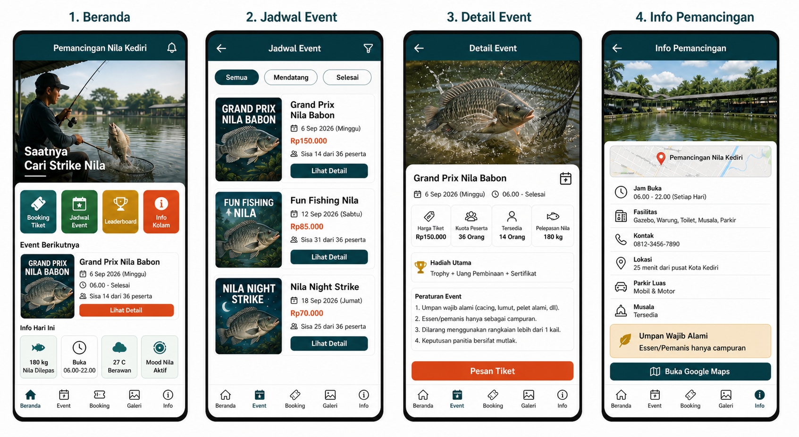
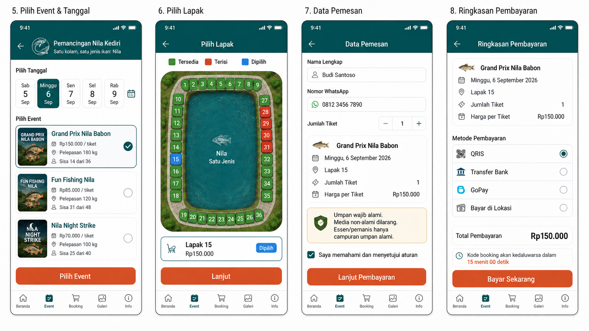
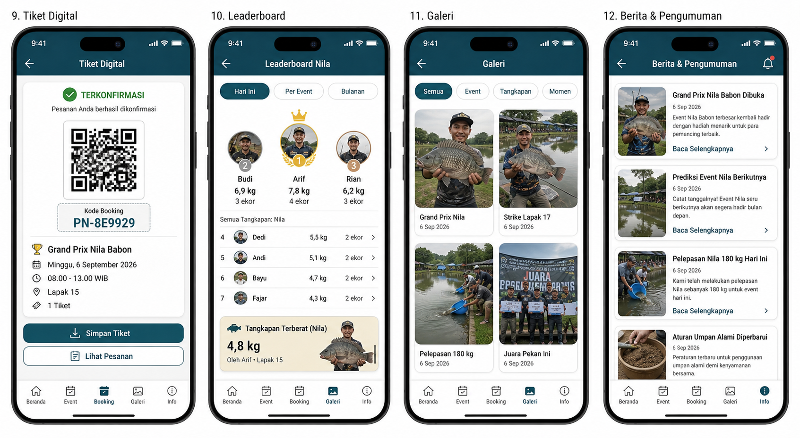
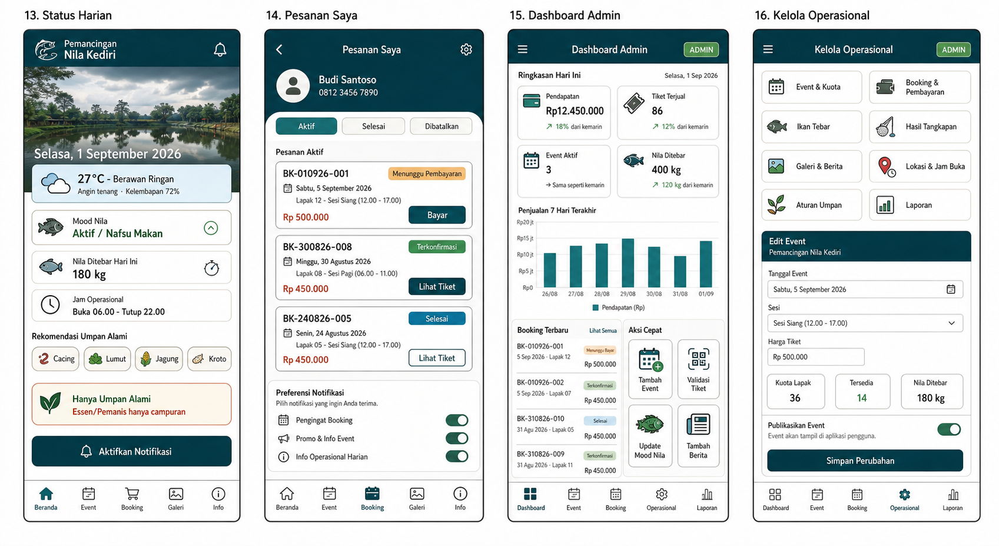

# Wireframe Aplikasi Pemancingan Nila Kediri

Dokumen ini menjadi indeks visual untuk implementasi berdasarkan `PRD.md`. Seluruh layar menggunakan konteks satu lokasi pemancingan dan satu jenis ikan, yaitu ikan nila.

## Board 1: Discovery dan Informasi

### 1. Beranda

- Hero event khusus nila
- Shortcut booking, jadwal event, leaderboard, dan informasi kolam
- Event terdekat
- Jumlah nila yang dilepas hari ini
- Jam buka dan tutup
- Cuaca dan mood nila

### 2. Jadwal Event

- Filter event semua, mendatang, dan selesai
- Nama, tanggal, harga, kuota, dan sisa tiket
- Seluruh event khusus ikan nila

### 3. Detail Event

- Tanggal, waktu, harga, kapasitas, sisa kuota, dan jumlah nila tebar
- Hadiah dan aturan event
- CTA pemesanan tiket

### 4. Informasi Pemancingan

- Jam operasional, fasilitas, kontak, parkir, dan musala
- Estimasi rute dari pusat Kota Kediri dan Google Maps
- Aturan umpan alami serta pengecualian essen/pemanis sebagai campuran

## Board 2: Booking dan Pembayaran

### 5. Pilih Event dan Tanggal

- Grand Mix Babaon: pelepasan 225 kg, tiket Rp100.000
- Event Nila 200 KG: pelepasan 200 kg, tiket Rp85.000
- Event Nila 150 KG: pelepasan 150 kg, tiket Rp70.000
- Event Nila 100 KG: pelepasan 100 kg, tiket Rp50.000
- Setiap paket menggunakan kolam yang memiliki total 82 lapak

### 6. Pilih Lapak

- Denah 82 lapak
- Status tersedia, terisi, dan dipilih
- Ringkasan lapak dan harga sebelum lanjut

### 7. Data Pemesan

- Nama lengkap, nomor WhatsApp, dan jumlah tiket
- Ringkasan event dan lapak
- Persetujuan wajib atas aturan umpan
- Umpan wajib alami, media non-alami dilarang, essen/pemanis hanya campuran

### 8. Ringkasan Pembayaran

- Ringkasan event, tanggal, lapak, kuantitas, dan total
- QRIS, transfer bank, GoPay, dan bayar di lokasi
- Batas waktu pembayaran dan CTA bayar

## Board 3: Tiket dan Komunitas

### 9. Tiket Digital

- QR code dan kode booking unik
- Detail event, jadwal, lapak, dan jumlah tiket
- Status booking dan akses menyimpan tiket

### 10. Leaderboard

- Filter harian, per event, dan bulanan
- Peringkat berdasarkan berat total dan jumlah ekor nila
- Highlight tangkapan nila terberat

### 11. Galeri

- Filter event, tangkapan, dan momen
- Dokumentasi pelepasan nila, hasil tangkapan, dan pemenang

### 12. Berita dan Pengumuman

- Event yang segera dibuka
- Prediksi event mendatang
- Berita pelepasan nila
- Pembaruan aturan umpan

## Board 4: Operasional dan Admin

### 13. Status Harian

- Cuaca, mood nila, jumlah nila tebar, dan jam operasional
- Rekomendasi umpan alami
- Pengingat bahwa essen/pemanis hanya boleh sebagai campuran
- Aktivasi notifikasi operasional

### 14. Pesanan Saya

- Tab aktif, selesai, dan dibatalkan
- Kode booking, event, tanggal, lapak, nilai transaksi, serta status pembayaran
- Akses bayar dan melihat tiket
- Preferensi notifikasi

### 15. Dashboard Admin

- Pendapatan, tiket terjual, event aktif, dan nila tebar
- Grafik penjualan tujuh hari
- Booking terbaru
- Aksi cepat membuat event, validasi tiket, update mood nila, dan berita

### 16. Kelola Operasional

- Event dan kuota
- Booking dan pembayaran
- Ikan tebar dan hasil tangkapan
- Galeri dan berita
- Lokasi, jam buka, dan aturan umpan
- Laporan
- Form edit event dan kontrol publikasi

## Aturan Implementasi

- `PRD.md` tetap menjadi sumber kebenaran fungsional.
- Wireframe menjadi referensi hierarki, komponen, navigasi, dan gaya visual.
- Seluruh data spesies harus bernilai nila.
- Jangan menambahkan fitur toko atau membership sebelum masuk ke scope PRD.
- Informasi pembayaran pada wireframe adalah rancangan UI; integrasi gateway dilakukan pada tahap backend.

## Status Implementasi MVP

Wireframe ini telah dijadikan referensi utama pada implementasi Kivy di `app.py`.

- Layar 1-4: beranda carousel, jadwal, detail event, dan informasi sudah aktif.
- Layar 5-9: pilihan event, denah 82 lapak, data pemesan, pembayaran, dan tiket sudah aktif.
- Layar 10-14: leaderboard, galeri, berita, status harian, dan pesanan sudah aktif.
- Layar 15-16: dashboard admin dan kelola operasional tersedia sebagai MVP lokal.
- Data booking tersimpan di SQLite; data event dan konten operasional masih berupa data contoh lokal.
- Pembayaran, cuaca, notifikasi, dan QR yang dapat dipindai memerlukan integrasi layanan produksi.

## Aset Carousel

- `assets/generated/carousel-event-nila.png`: lomba nila pada pagi hari.
- `assets/generated/carousel-night-nila.png`: event nila malam hari.
- `assets/generated/hero-nila.png`: suasana umum kolam nila.

Carousel beranda berpindah otomatis setiap lima detik dan dapat dikontrol melalui tombol sebelum/sesudah.

Pratinjau implementasi beranda tersedia di `wireframes/implementation-home.png`.
Pratinjau denah 82 lapak tersedia di `wireframes/implementation-lapak-82.png`.
Pratinjau daftar event tersedia di `wireframes/implementation-events.png`.
Pratinjau informasi pemancingan tersedia di `wireframes/implementation-info.png`.
Pratinjau tiket digital tersedia di `wireframes/implementation-ticket.png`.
